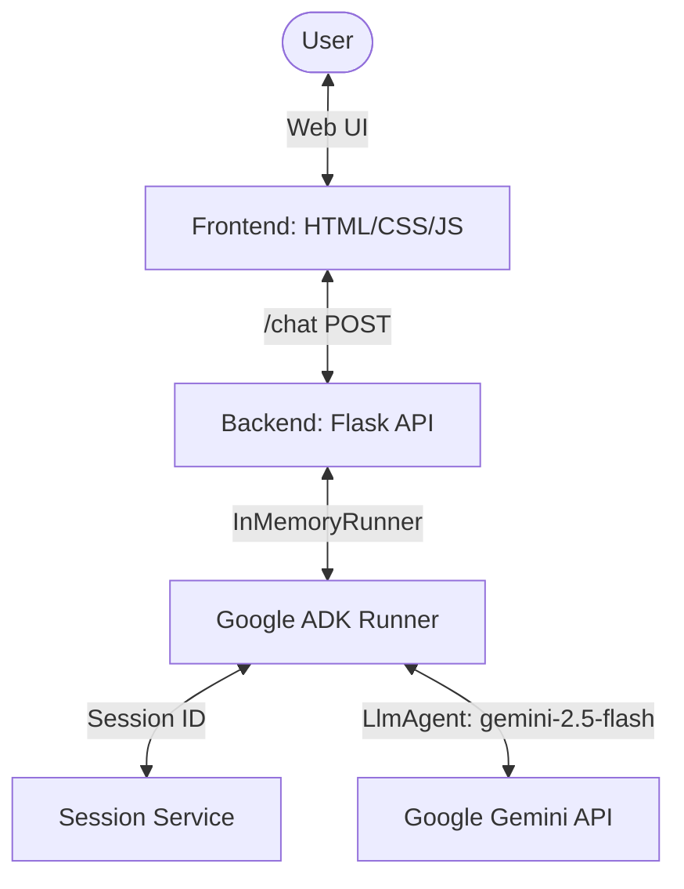

# AI Companion - WakuWaku

A beautifully designed, premium web-based interactive AI Companion application. The application brings an AI character to life with real-time lip-sync voice synthesis, dynamic text-to-speech, and responsive conversational intelligence powered by the **Google Agent Development Kit (ADK)** and Gemini models.

---

## Key Features

*   **Interactive Voice Companion**: Fully vocalized companion with real-time text-to-speech (TTS) playback.
*   **Dynamic Lip-Syncing**: High-fidelity, real-time visual mouth movement synchronized with voice synthesis.
*   **Intelligent Grapheme Typewriter**: Smooth typewriter rendering that supports advanced multilingual layouts and emoji grapheme clusters perfectly.
*   **Sleek Modern UI**: Premium, dark-themed responsive container designed with a vibrant, modern aesthetic.
*   **Persistent Sessions**: Unique user-to-agent session management powered by the Google ADK session service.

---

## Architecture

The app uses a lightweight client-server model:



---

## Getting Started

### 1. Requirements

Ensure you have Python 3.10+ installed.

### 2. Setup API Key

You must save your Google Gemini API Key. If you have a key, save it to `~/gemini_key.txt` or execute:

```bash
./setupAPIkey.sh
```

### 3. Initialize & Install Dependencies

Run the setup scripts to set up the virtual environment:

```bash
source /home/yahnik_rohse/.venv/bin/activate
pip install -r requirements.txt
```

### 4. Running the Web Server

Start the application with:

```bash
python app.py
```

The server will spin up locally on `http://127.0.0.1:5000`.

---

## Repository Structure

*   [app.py](file:///home/yahnik_rohse/companion-python/app.py) - Main Flask routing, session management, and runner middleware.
*   [character.py](file:///home/yahnik_rohse/companion-python/character.py) - AI Companion agent configuration using Google ADK `LlmAgent`.
*   [templates/index.html](file:///home/yahnik_rohse/companion-python/templates/index.html) - Application shell with premium UI components.
*   [static/style.css](file:///home/yahnik_rohse/companion-python/static/style.css) - Styling rules featuring modern typography and dynamic effects.
*   [static/app.js](file:///home/yahnik_rohse/companion-python/static/app.js) - Real-time TTS speech synthesis, dynamic animation handlers, and client-side communication logic.
